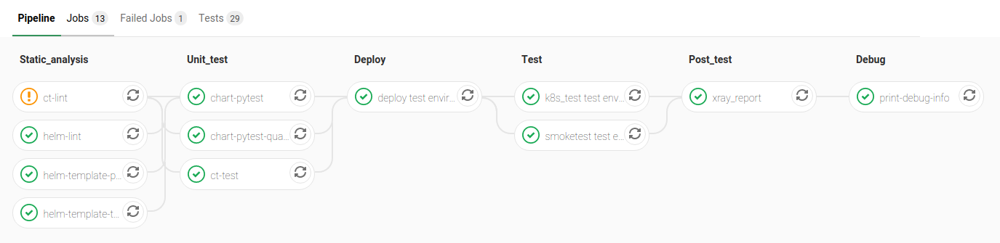
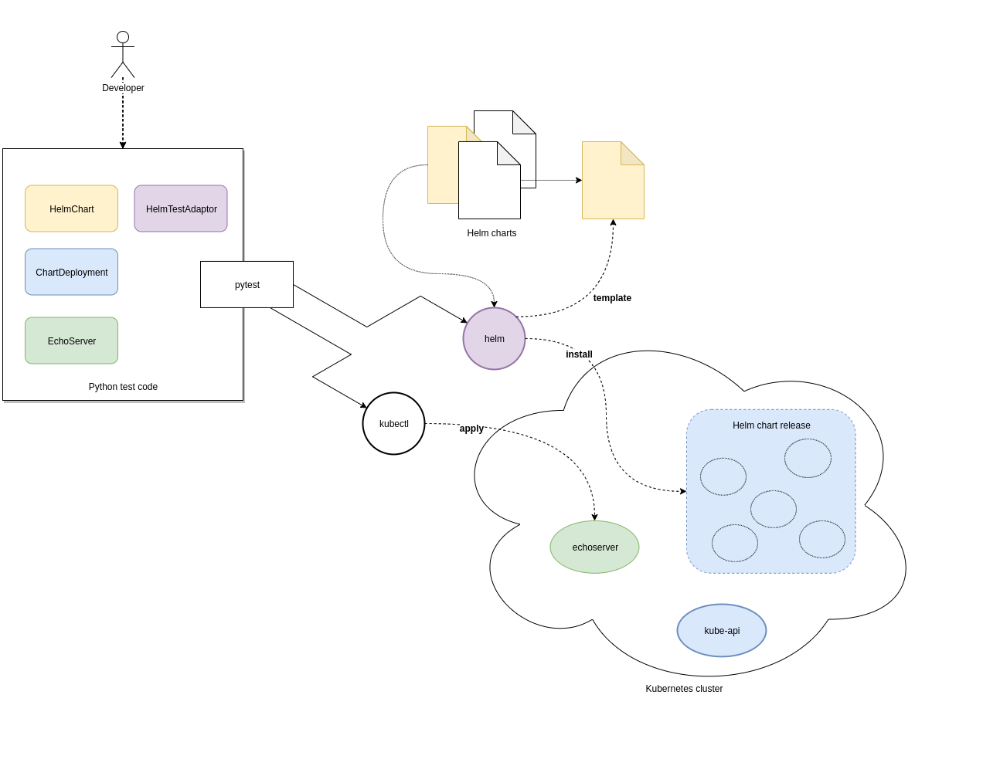

Testing SKAMPI 
==============
The SKA MPI codebase ultimately holds all the information required to deploy and configure the complete prototype.
This information is encapsulated as a collection of `Helm <https://helm.sh/>`_ charts, Makefiles and any other
scripts, components to support its test and deployment.

This page outlines the various categories and approaches one can employ to test various aspects of SKA MPI prototype
that can be implemented in this repository.

Testing Infrastructure as Code
------------------------------
There is a substantial amount of infrastructure and its constituent parts (e.g. Kubernetes resources and their
configuration) that forms part of The Telescope. This configuration is orthogonal to the functionality of the
software components that are deployed, but changes to them can result in faults in deployment and operation of 
the system.

Testing at the appropriate level will ensure faster feedback of changes, reducing frustration for everyone and
ultimately improve the quality of the system. **Troubleshooting faults in a distributed system caused by
a typo in configuration is no fun!**

To support testing, various different jobs are executed as part of the SKAMPI build pipeline and some 
`testware <https://en.wikipedia.org/wiki/Testware>`_ has been developed to aid in testing.

Pipeline Stages for Testing
^^^^^^^^^^^^^^^^^^^^^^^^^^^

The stages of the pipeline related to testing are outlined below:

+-------------------+------------------------------------------------------------------------------------------------------------------+
|       Stage       |                                                   Description                                                    |
+===================+==================================================================================================================+
| Static_analysis   | Tests aspects of charts that do not require their deployment, e.g. linting                                       |
+-------------------+------------------------------------------------------------------------------------------------------------------+
| Unit_test [unit]_ | Tests here might deploy them to an                                                                               |
|                   | `ephemeral test environment <https://pipelinedriven.org/article/ephemeral-environment-why-what-how-and-where>`_. |
+-------------------+------------------------------------------------------------------------------------------------------------------+
| Test              | Tests to be executed in-cluster alongside the fully deployed SKAMPI prototype.                                   |
+-------------------+------------------------------------------------------------------------------------------------------------------+

**SKAMPI Gitlab CI Pipeline** (as of January 2020):
|CI Pipeline|

Python testware
^^^^^^^^^^^^^^^
Some components have been developed to assist in testing the Helm charts using Python. They are intended to be 
used with `pytest <http://pytest.org/>`_ as a test runner and there are currently three jobs in the pipeline that 
are configured to executed them, filtered based on `pytest markers <https://docs.pytest.org/en/latest/example/markers.html>`_: 

Pipeline jobs
"""""""""""""
- *helm-template-pytest* runs as part of the *Static_analysis* stage in the pipeline executes Python tests marked 
  with ``no_deploy``.

- *chart-pytest* runs as part of the *Unit_test* stage and will execute tests marked with the ``chart_deploy`` 
  marker [unit]_.

- *chart-pytest-quarantine* also runs during the *Unit_test* stage and executes tests marked with ``quarantine`` 
  but do not fail the build if they do.

Pytest configuration
""""""""""""""""""""
As per convention, Pytest is will collect all tests placed in the ``/tests/`` directory. The following markers are
currently defined (see */pytest.ini* for more details):

``no_deploy``
    Indicates tests that will not require any resources to be deployed into a cluster. Generally, tests that
    parse and transform the source chart templates.

``chart_deploy``
    Indicates tests that requires resources to be deployed into cluster such as the Helm chart under test and
    any other collaborating testware.

``quarantine``
    Indicates tests that should be executed but not necessarily break the build. Should be used sparingly. 

Test lifecycle
""""""""""""""
The lifecycle (setup, execute, teardown) of tests are managed by pytest fixtures, defined in `/tests/conftest.py`.
The ``infratest_context`` fixture in particular will determine if tests that involve deployments are included in the
pytest run, i.e. ``the chart_deploy`` marker is included. It will then:

1. invoke **kubectl** to create a namespace for the test resources(pods, services, etc.) to be deployed into 
2. ensure this namespace is deleted after the test run

**Note**: the default namespace is ci, but can be overriden by specifying the custom pytest option,
``--test-namespace``. When running inside the pipeline, this flag is set to ``ci-$CI_JOB_ID`` so each job will use
its own namespace and resources, ensuring test isolation.

Test support
""""""""""""

A collection of useful components and functions to assist in testing can be found in the ``tests.testsupport`` module:

``testsupport.util``:
    Functions that may be useful in testing such as `wait_until` which allows polling, retries and timeouts.

``testsupport.helm.HelmChart``:
    Represents a Helm chart that is the collection of YAML template files and not necessarily a set of deployed
    Kubernetes resources. Primarily used to assist in testing the policies in YAMl specifications, i.e. ``no_deploy``
    tests.

``testsupport.helm.ChartDeployment``: 
    Represents a deployed Helm chart and offers access to its resources in-cluster their metadata (by querying the
    Kubernetes API server).

``testsupport.helm.HelmTestAdaptor``:
    A rudimentary adaptor class to manage th interaction with the Helm CLI.

``testsupport.extras.EchoServer``:
    Represents a pod that can be deployed alongside the chart under test, containing a basic Python HTTP server that
    can receive commands. Currently it only supports echoing any HTTP POST sent to the `/echo` path. A handle to this
    is provided by the `print_to_stdout` method.

Charts are deployed via Helm and the `HelmTestAdaptor`. It's available as a Pytest fixture or you can import it from
the ``tests.testsupport.helm`` module.

The ``ChartDeployment`` class is an abstraction to represent a deployed chart and offers access to its resources
in-cluster (by querying the Kubernetes API) and metadata (such as ``release_name``).

In fact, **instantiating a ChartDeployment in code will deploy the specified chart**. A useful pattern is to create
pytest fixture that represents the chart to be deployed and yields a ``ChartDeployment`` object. It can also call
``.delete()`` to ensure the chart is deleted and pytest fixture scope can be used to a chart's lifespan. For an
example of this see the ``tango_base_release`` fixture in */tests/tango_base_chart_test.py*.

The diagram below illustrates the relationship between the Python classes in test code, CLI tools and the cluster.

|Infra Testware|

Third-party libraries
"""""""""""""""""""""
- `python kubernetes client <https://github.com/kubernetes-client/python>`_ is the official kubernetes API client for
  Python. It's provided as a pytest fixture, ``k8s_api`` and also used by ``ChartDeployment`` to obtain a list of deployed
  pods(see get_pods method).

- `testinfra <https://testinfra.readthedocs.io/en/latest/index.html>`_ is a library that allows connecting to pods
and asserting on the state of various things inside them such as open ports, directory structure, user accounts, etc.

.. [unit] A unit in this context is a Helm chart that can be deployed and tested.